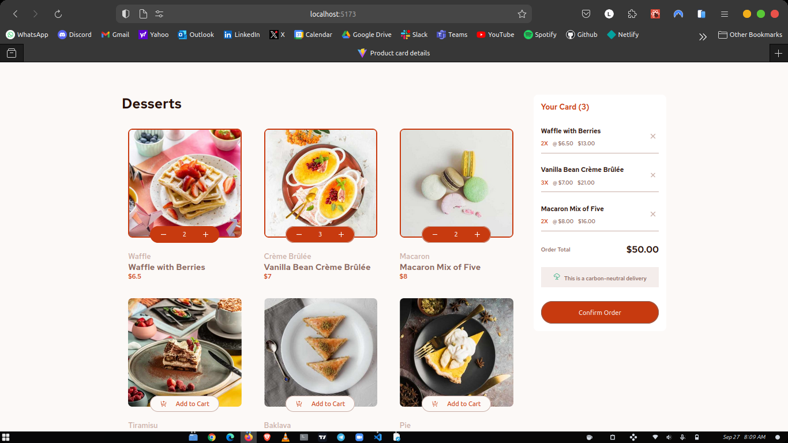
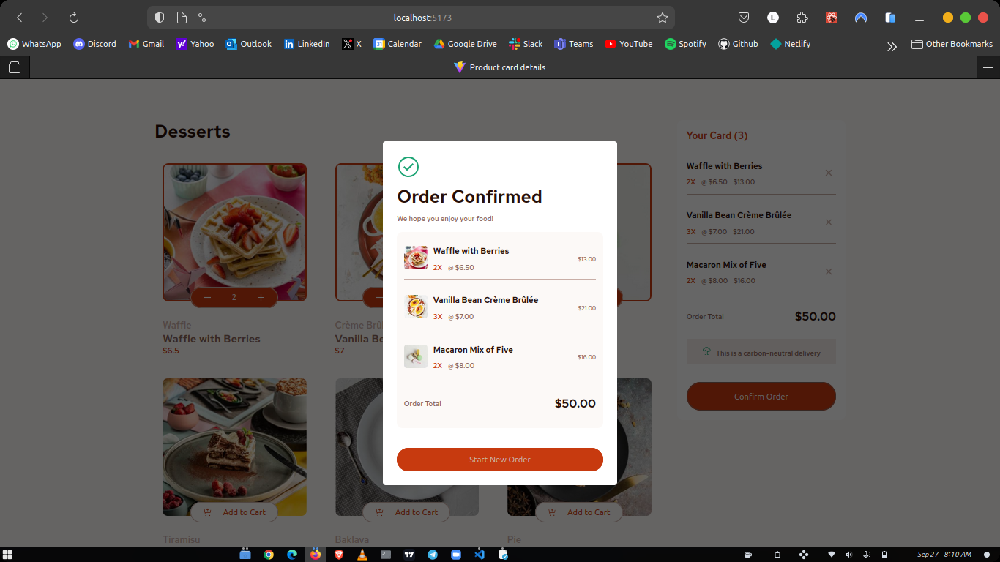
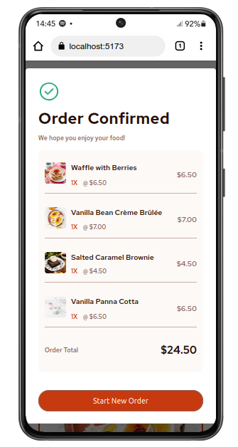
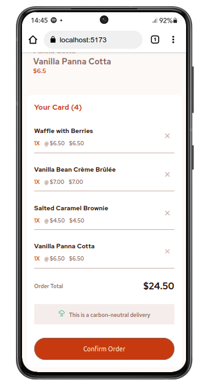

# Product Card Details

This project is a product card details application built using ReactJS. It utilizes the useState and useEffect hooks for state management and incorporates styled-components for styling.

## Features

- Add items to the cart and remove them
- Increase/decrease the number of items in the cart
- See an order confirmation modal when clicking "Confirm Order"
- Reset selections by clicking "Start New Order"
- Responsive layout for different screen sizes
- Hover and focus states for interactive elements

## Live Link

You can check out the live project [here](https://isaac-product-card-details.vercel.app/).

## GitHub Repository

The source code for this project is available on [GitHub](https://github.com/Oluwa-Laughter/product-card-details).

## Screenshots

## Project Author:

- Website - [Isaac Makinde](https://github.com/Oluwa-Laughter)
- Twitter - [LAUGHTER](https://www.x.com/isaacmakinde_)
- LinkedIn - [Isaac Makinde](https://www.linkedin.com/in/isaacmakinde)
